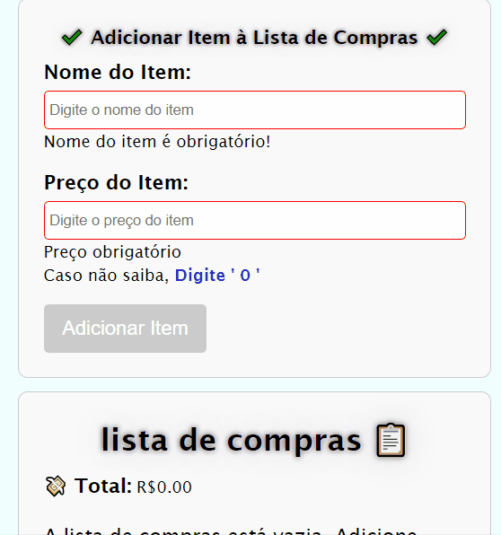

# Lista de Compras Angular
==========================

### Tecnologias Utilizadas
- Angular
- TypeScript
- HTML
- SCSS
- Web Storage
- Local Storage

### Funcionalidades
- Listagem de produtos
- Adicionar produtos
- Remover produtos
- Editar produtos
- Ordenação dos produtos Comprados e dos produtos na lista de Compras
- Valor total dos itens comprados
- Valor total dos itens na lista de compras
- Exclusão de produtos Comprados, movendo os mesmos para a lista de compras.

### Guia de Uso
- Após entrar no site, comece adicionando o produto na lista de itens:
   - Após o envio do Produto, o site salva e renderiza o produto adicionado.
- Com produto(s) adicionado(s), você pode excluir ou editar qualquer produto cadastrado.
- Para Marcar os itens ta lista como adquiridos é preciso clicar no botão `add 🛒`

### criação passo a passo resumido
- Passo 1:
- Criar um novo componente chamado `add-items.component.ts`. 
- Ajustar o template e a lógica para enviar os dados dos items para o `LocalStrorage`.
- Dados requeridos: `Nome` e `Preço`

- Passo 2:
- Criar um novo componente pai chamado `list-items.component.ts`, que irá acoplar os componentes relativos ao gerenciamento dos produtos.
- Ajutar a lógica para pegar os dados do local storage e mostrar na interface.
- criar um componente chamado `card.component.ts`, para iterar sobre o array de itens.
- criar lógica de eventos de `(click)` para  `Editar`, `Excluir` e `Comprar` itens da lista de compras.

- Passo 3
- Criar um novo componente chamado `buy-items.component.ts`, reponsavel em selecionar aqueles itens do evento `comprar()` disparado atravez do botão `comprar`.
- criar um novo componente chamado `card-buy-item` para iterar com o itens comprados, e nele ja conter todo o temblate relativo ao card dos itens comprados.

###### Implementação de Icones de Código Unicode decimal, exemplo: `&#128512;` para 😀.

### Preview 

